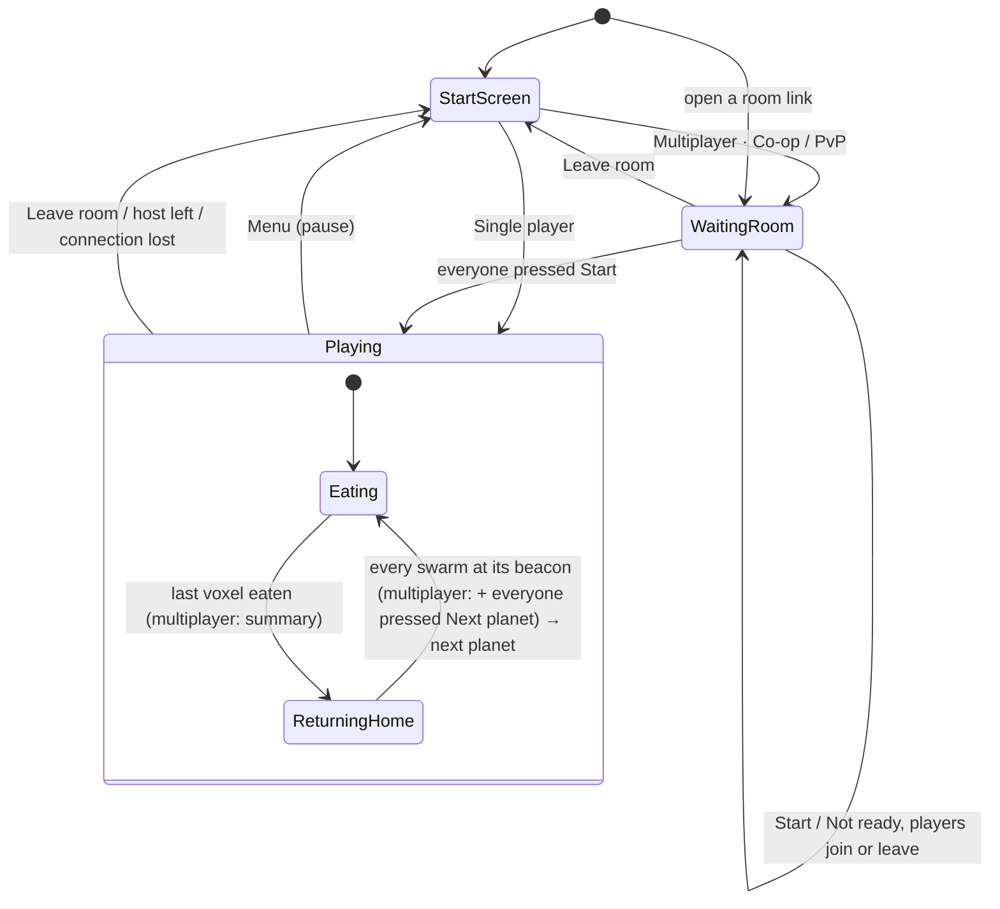

# Architecture

Hive Hunger is a static web page: ES modules, Three.js r128 (UMD build from cdnjs) and PeerJS 1.5.4 (from unpkg) — no build step, no server code. Every tunable value lives in `js/config.js`.

## Modules

| File | What it does |
| --- | --- |
| `js/main.js` | Entry point: reads `?room=`, creates the game (solo or guest), the settings panel, the start screen and room panel, starts the loop |
| `js/config.js` | All parameters: planet, flock, feeding, beacon, marker, network, slider ranges |
| `js/version.js` | Game version (keep in sync with `CHANGELOG.md`) |
| `js/three/Game3D.js` | Scene, camera, input, roles (solo / host / guest), planet lifecycle, HUD data, guest-side handling of network messages |
| `js/three/Player.js` | One player: swarm + leader + beacon + settings + score; per-player simulation step, commands, recall, return home |
| `js/three/Swarm3D.js` | The flock (boids), feeding, collisions, getting unstuck, drawing; `aroundPlanet()` path helper |
| `js/core/Leader.js` | The swarm's "brain": a point the flock heads for; stays at matter, finds new matter, follows clicks |
| `js/three/VoxelPlanet.js` | Voxel planet: terrain, claims, eating, exposed-voxel instancing, raycast, seed, removal log, solid bitsets, atmosphere |
| `js/three/Debris3D.js` | Debris point cloud |
| `js/three/Space3D.js` | Sky sphere with nebulae + star layers (one group, turned by the spin) |
| `js/three/SpawnBeacon.js` | Clickable beacon at each player's spawn point |
| `js/three/ClickMarker.js` | Ring shown where the player clicked |
| `js/net/Net.js` | `NetHost` / `NetGuest` over PeerJS: rooms, joining, pings, timeouts |
| `js/net/Protocol.js` | Binary snapshot and planet messages |
| `js/ui/Hud.js` | Planet counter, hints, multiplayer scoreboard and banner |
| `js/ui/ControlPanel.js` | Sliders, the "Eat nearest block" toggle, "Reset to default" |
| `js/ui/StartScreen.js` | Start screen (Single player / Co-op / PvP) and the multiplayer waiting room (link, players, Start) |
| `js/ui/Summary.js` | Multiplayer summary after a planet: per-player results, winner, Next planet |
| `js/ui/Lobby.js` | Room panel during a multiplayer match: room, link, leave |
| `js/ui/dom.js` | Small DOM helpers for the menus |
| `js/utils/*` | Noise (fBm), terrain colours, nebula/star colours |

## Game states

- **Start screen** and **waiting room** are the overlay (`StartScreen`); `game.started` is `false`, so swarms wait at their beacons and the planet doesn't turn. The single-player **Menu** button sets `started` back to `false` (pause) and shows the start screen; **Single player** carries on.
- **Playing:** `game.started` is `true`. In multiplayer the room panel (`Lobby`, bottom left) has the link and **Leave room**; leaving reloads the page without `?room=`, i.e. back to the start screen.
- Someone who opens a room link while the match is running skips the waiting room.
- **Returning home:** after the last voxel, every swarm flies to its beacon; the next planet appears when all have gathered (or after `beacon.returnTimeoutFrames`). In multiplayer the summary (`Summary`) is open meanwhile and the next planet also waits until every player has pressed **Next planet** (`Player.nextReady`).

## Frames of reference and the planet spin

The simulation runs in the **planet's frame**: voxels never move. To make the planet look like it spins, the camera, the sky group, the sun and the beacons (they live in the sky group) turn around the planet by `spin` (`planet.spinSpeed` per frame). The swarm flies in the planet's frame, so on screen it turns together with the planet. A beacon moves in the planet's frame, so a swarm flying home follows a slowly moving target.

## One frame (solo / host)

Until the match has started (`game.started`: Single player chosen, or every player in the room pressed Start; the single-player **Menu** button sets it back to `false`, which pauses the game) the frame only draws: swarms wait at their beacons and the planet doesn't turn.

1. `spin += spinSpeed`, apply it to camera, sky and sun.
2. For every player (`Player.update`):
   - collect exposed voxels within `leader.feedSenseRadius` of the swarm target (`VoxelPlanet.exposedNear`) and count the free (unclaimed) ones;
   - update the leader: stay while free voxels are near, otherwise drift to the nearest free voxel; follow a click or the beacon when told to;
   - update the swarm (`Swarm3D.update`).
3. If the planet's last voxel is gone: every swarm flies home; when all have gathered (or after a timeout) the next planet appears.
4. Host only: every `net.snapshotEvery` frames, send a snapshot to the guests.

## The swarm (`Swarm3D.update`)

- **Flocking (boids):** separation (within `spacing`), alignment and cohesion with neighbours found through a spatial hash grid, plus steering towards the unit's target. Every unit flies at the same constant `speed`; only its direction changes, at most `turnRate` per frame. What is drawn follows that direction smoothly (`turnSmoothing`).
- **Feeding:** a unit without a bite picks one — near the swarm target, or (with "Eat nearest block") the nearest free voxel to itself. The voxel is **claimed** (`VoxelPlanet.claims`), so nobody else takes or bites it; bites are shared only when the planet has fewer exposed voxels than there are units. A unit lands when it touches its bite (or a free voxel right next to it) or comes within `reachDistance`, then eats a crater of radius `power` over `eatFrames` frames, skipping voxels claimed by others.
- **Collisions:** movement goes axis by axis in substeps; a solid voxel stops movement on that axis — no bounce and no passing through; the unit slides along the surface. Units in passing never eat.
- **Long trips:** `aroundPlanet()` gives a waypoint over the surface when the straight path would go through the planet, or straight up when the unit is down in a pit.
- **Getting unstuck:** no progress for `stuck.frames` while touching a wall → bite through the blocking voxel (if unclaimed) or turn in a random direction.

## The planet (`VoxelPlanet`)

- A sphere of voxels (`radius` / `voxelSize` ≈ 460 000 voxels). Colours come from 3D noise on the sphere (`terrainColor`) for the outer `terrainDepth`, rock below.
- Only **exposed** voxels (with an empty neighbour) are instances of the `InstancedMesh`; when a voxel is eaten, its hidden neighbours are added. This keeps tens of thousands of instances instead of hundreds of thousands.
- `seed` makes the planet reproducible. `log` collects eaten voxels for the network; `solidBits()` / `applySolidBits()` transfer the whole state to a guest who joins mid-planet.

## Roles

- **solo** — everything above runs locally; one player.
- **host** — the same, with up to 3 more players whose commands and settings arrive over the network, plus snapshots sent out.
- **guest** — no simulation: builds the planet from the host's seed, removes the voxels the host reports (emitting debris locally), shows swarm positions from snapshots (eased towards them every frame), sends clicks, recall and settings. See `docs/MULTIPLAYER.md`.
